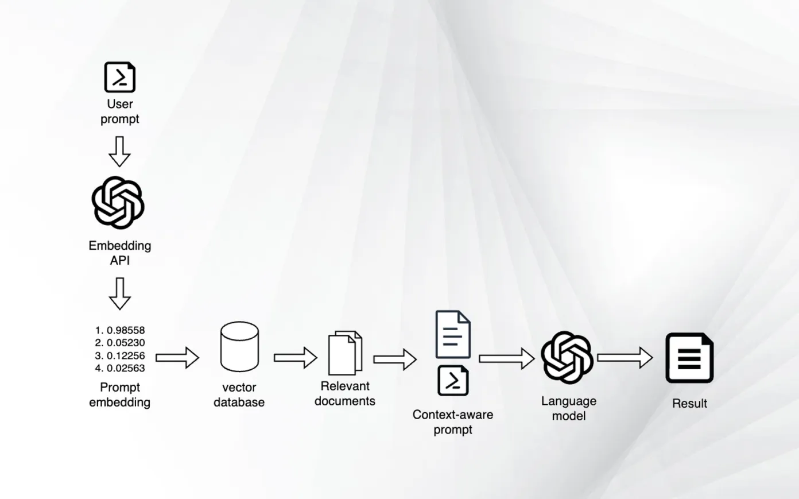
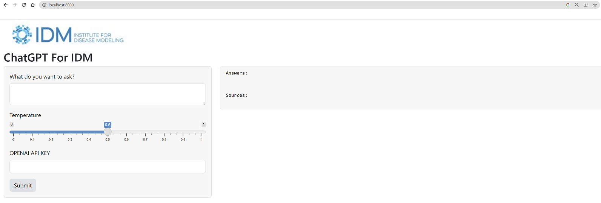

## ChatGPT for your own contents
this example is based on below tutorial:  
https://blog.langchain.dev/tutorial-chatgpt-over-your-data/

## How to run
- install requirements.txt
- run command `shiny run app.py`
- open a browser and check http://localhost:8000

